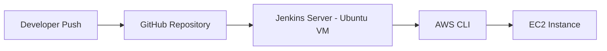
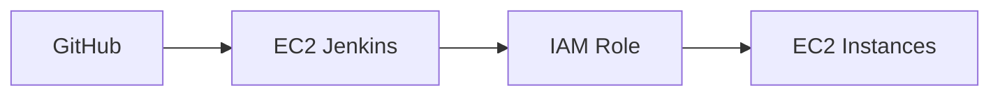

# 🚀 Jenkins EC2 Lifecycle Control Pipeline

A production-style DevOps project that demonstrates:

- Pipeline as Code  
- SCM-based Jenkins Pipelines  
- SSH authentication with GitHub  
- AWS CLI automation  
- EC2 lifecycle management  
- Secure CI/CD architecture design  

---

# 🏗 Architecture



## 🔄 Flow Explanation

1. Developer pushes pipeline code to GitHub.  
2. Jenkins pulls the Jenkinsfile from SCM.  
3. Jenkins executes AWS CLI commands.  
4. EC2 instance state is modified.  

---

# 📁 Repository Structure

```
devops-jenkins-pipelines/
├── README.md
└── ec2-control/
    └── Jenkinsfile
```

---

# 🎯 Features

- ✅ Parameterized pipeline  
- ✅ START / STOP / REBOOT / STATUS  
- ✅ State validation before action  
- ✅ Prevents action on terminated instances  
- ✅ Waits for state transitions  
- ✅ SCM-based pipeline execution  
- ✅ SSH-based GitHub authentication  

---

# ⚙️ Environment Setup

## 1️⃣ Prerequisites

- Ubuntu VM (VirtualBox or EC2)  
- Jenkins installed  
- Git installed  
- AWS CLI installed  
- GitHub account  
- AWS IAM User with EC2 permissions  

---

## 2️⃣ Install Dependencies

```bash
sudo apt update
sudo apt install git -y
sudo apt install awscli -y
```

Verify:

```bash
git --version
aws --version
```

---

# 🔐 AWS Configuration

Create an IAM user with permissions:

- ec2:StartInstances  
- ec2:StopInstances  
- ec2:RebootInstances  
- ec2:DescribeInstances  

Configure AWS CLI:

```bash
aws configure
```

Verify:

```bash
aws sts get-caller-identity
```

---

# 🔑 GitHub SSH Authentication

## Generate SSH Key

```bash
ssh-keygen -t ed25519 -C "jenkins-vm"
```

Add the public key to:

GitHub → Settings → SSH and GPG Keys  

Test:

```bash
ssh -T git@github.com
```

---

# 🔧 Jenkins Configuration

## Create New Pipeline Job

Select:

**Pipeline script from SCM**

SCM: Git  

Repository URL:

```
git@github.com:<your-username>/devops-jenkins-pipelines.git
```

Branch:

```
*/main
```

Script Path:

```
ec2-control/Jenkinsfile
```

Credentials:

- Kind: SSH Username with private key  
- Username: git  
- Private Key: Paste contents of `~/.ssh/id_ed25519`  

---

# 🧪 Running the Pipeline

Click:

**Build with Parameters**

Provide:

- ACTION → START / STOP / REBOOT / STATUS  
- INSTANCE_ID → EC2 instance ID  

Pipeline Stages:

1. Validate Input  
2. Check Current State  
3. Perform Action  
4. Wait for State Transition  
5. Display Final Status  

---

# 🛡 Security Model (Current)

- IAM User with Access Keys  
- Credentials stored via AWS CLI (`~/.aws/credentials`)  
- SSH authentication for GitHub  

---

# 🔒 Production Upgrade Path

Current: IAM User + Static Keys  

Recommended:

1. Move Jenkins to AWS EC2  
2. Attach IAM Role to EC2 instance  
3. Remove static credentials  
4. Delete IAM access keys  

Target Architecture:



## Benefits

- No stored secrets  
- Automatic credential rotation  
- Cloud-native authentication  
- Enterprise-grade security  

---

# 🧠 DevOps Concepts Demonstrated

- Infrastructure automation  
- CI/CD pipeline design  
- Secure authentication patterns  
- AWS CLI automation  
- State-aware infrastructure control  
- Production hardening mindset  

---

# 📈 Future Enhancements

- Convert to Jenkins Shared Library  
- Add Multibranch Pipeline  
- Add GitHub Webhooks  
- Implement Terraform provisioning  
- Containerize Jenkins  
- Deploy Jenkins behind Nginx + SSL  
- Move to IAM Role authentication  

---

# 👨‍💻 Author

Kushagra Agarwal  
DevOps Engineer (Learning Phase → Production Mindset)
